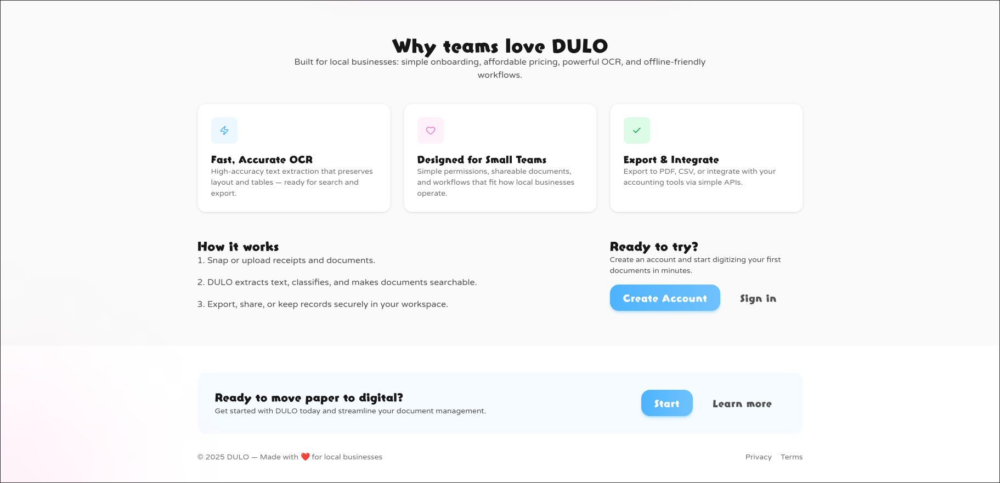
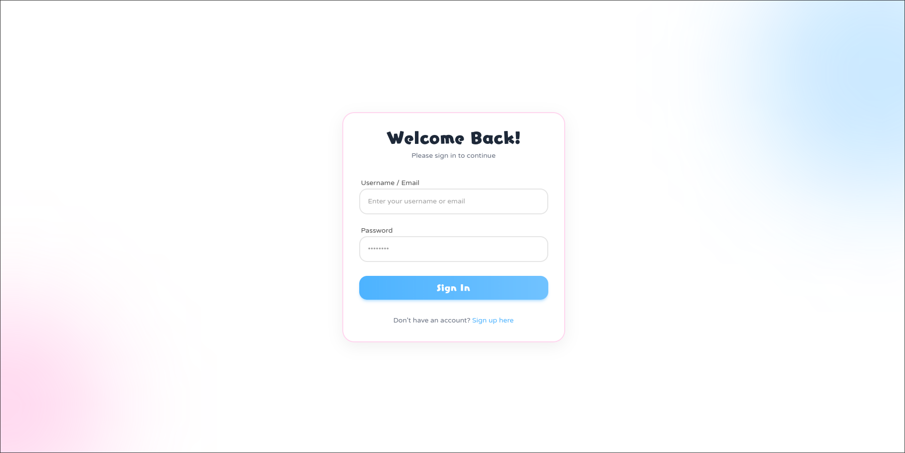
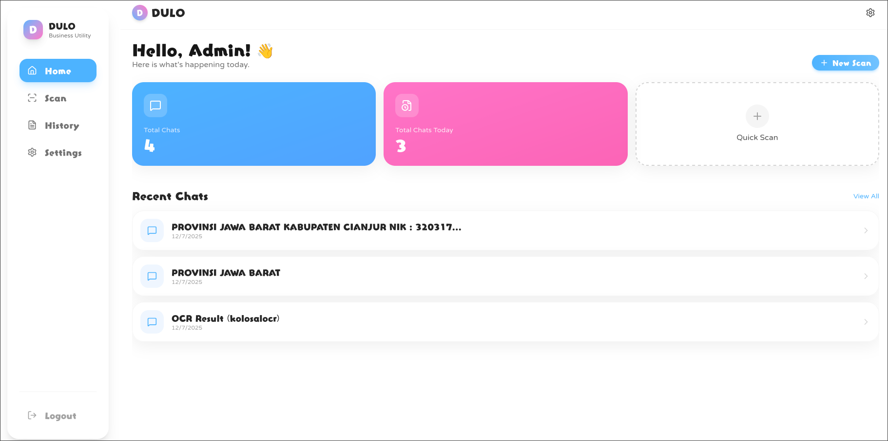
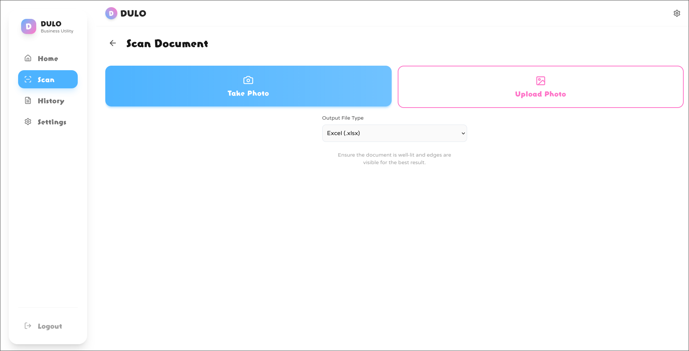
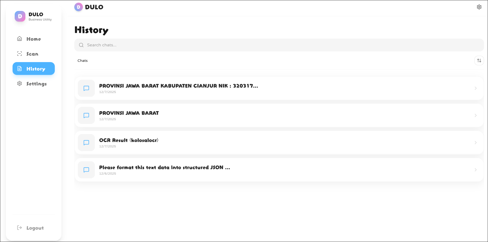
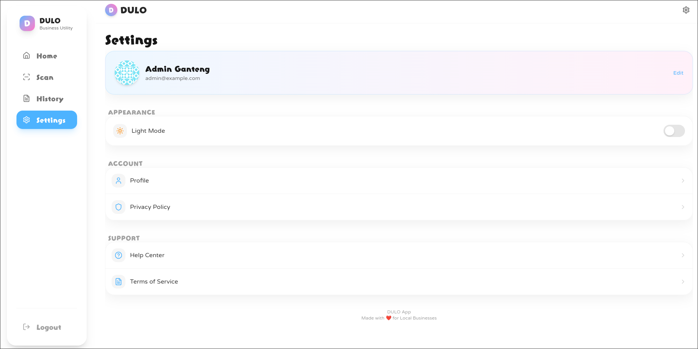
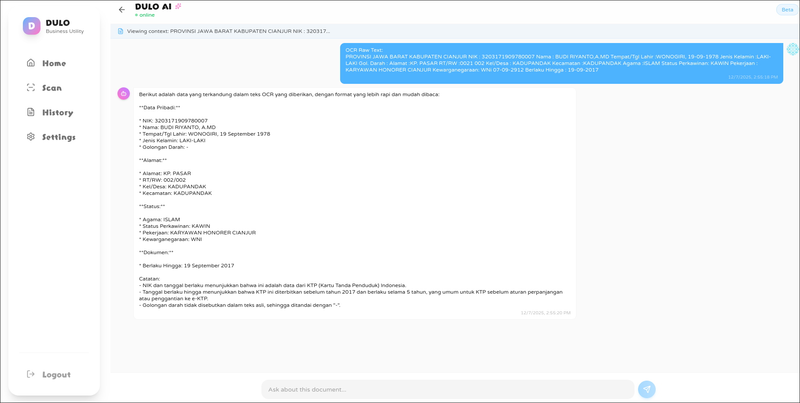

# DULO - Digitalisasi Usaha Lokal

**Transform Your Manual Bookkeeping into Smart Digital Records**

DULO is an intelligent document digitization platform designed to help local businesses convert their manual bookkeeping records, receipts, and handwritten notes into structured digital formats (Excel/PDF) with AI-powered insights.

---

## 🎯 Main Purpose

Manual bookkeeping is still prevalent among small and local businesses. DULO solves this problem by:

- **Digitizing** handwritten ledgers, receipts, and notes through OCR technology
- **Converting** captured data into organized Excel spreadsheets or PDF documents
- **Providing** AI-powered consultation to help business owners understand and analyze their financial data

---

## ✨ Key Features

### 📸 Smart Document Capture
- Capture photos of handwritten bookkeeping records, receipts, and business notes
- Advanced OCR (Optical Character Recognition) powered by PaddleOCR
- Support for various document types and handwriting styles

### 📊 Automatic Data Conversion
- Convert captured data into structured Excel spreadsheets
- Export clean, formatted PDF documents
- Maintain data integrity and accuracy

### 🤖 AI-Powered Consultation
- Ask questions about your financial data directly to AI
- Get insights, summaries, and analysis of your bookkeeping records
- Understand trends, patterns, and potential issues in your business finances

### 🔐 Secure & Private
- User authentication with JWT tokens
- Email verification system
- Secure data storage and processing

---

## 🛠️ Tech Stack

### Frontend
- **React** - UI library
- **Vite** - Fast build tool and dev server
- **TypeScript** - Type-safe JavaScript
- **Tailwind CSS** - Utility-first CSS framework
- **Framer Motion** - Animation library
- **React Router** - Client-side routing
- **Radix UI** - Accessible component primitives

### Backend
- **Python 3.11** - Programming language
- **Flask** - Lightweight web framework
- **PaddleOCR** - OCR engine for text recognition
- **JWT** - Authentication & authorization
- **SQLite/PostgreSQL** - Database options
- **APScheduler** - Background task scheduling
- **XlsxWriter** - Excel file generation
- **ReportLab** - PDF generation

### DevOps
- **Docker** - Containerization
- **Docker Compose** - Multi-container orchestration
- **Nginx** - Reverse proxy and static file serving
- **Gunicorn** - WSGI HTTP server

---

## 🚀 Getting Started

### Prerequisites

Make sure you have the following installed:
- **Docker** (20.10 or higher)
- **Docker Compose** (v2.0 or higher)

### Installation & Running

#### Option 1: Using Docker Compose (Recommended)

1. **Clone the repository**
   ```bash
   git clone <repository-url>
   cd dulo
   ```

2. **Configure environment variables**
   
   Copy the example environment file in the backend directory:
   ```bash
   cp backend/.env.example backend/.env
   ```
   
   Edit `backend/.env` and configure your settings:
   ```bash
   # Database
   DATABASE_TYPE=sqlite
   DATABASE_PATH=database/database.db
   
   # JWT Secret (change this in production!)
   JWT_SECRET_KEY=your-super-secret-key-change-in-production
   
   # Email Configuration (optional)
   RESEND_API_KEY=your-resend-api-key
   EMAIL_FROM=noreply@yourdomain.com
   
   # AI Configuration (optional)
   KOLOSAL_API_KEY=your-kolosal-api-key
   KOLOSAL_OCR_API_KEY=your-kolosal-api-key
   ```

3. **Build and run with Docker Compose**
   ```bash
   docker-compose up --build
   ```
   
   Or run in detached mode:
   ```bash
   docker-compose up -d --build
   ```

4. **Access the application**
   - Frontend: http://localhost:3000
   - Backend API: http://localhost:8000
   - Health Check: http://localhost:8000/health

5. **Stop the application**
   ```bash
   docker-compose down
   ```

#### Option 2: Manual Setup (Development)

##### Backend Setup

1. **Navigate to backend directory**
   ```bash
   cd backend
   ```

2. **Create virtual environment**
   ```bash
   python -m venv venv
   source venv/bin/activate  # On Windows: venv\Scripts\activate
   ```

3. **Install dependencies**
   ```bash
   pip install -r requirements.txt
   ```

4. **Configure environment**
   ```bash
   cp .env.example .env
   # Edit .env with your configuration
   ```

5. **Initialize database**
   ```bash
   python create_tables.py
   python seeders.py
   ```

6. **Run the backend server**
   ```bash
   python app.py
   ```
   
   Backend will be available at http://localhost:8000

##### Frontend Setup

1. **Navigate to frontend directory**
   ```bash
   cd frontend
   ```

2. **Install dependencies**
   ```bash
   npm install
   ```

3. **Run development server**
   ```bash
   npm run dev
   ```
   
   Frontend will be available at http://localhost:5173 (Vite default port)

4. **Build for production**
   ```bash
   npm run build
   ```

---

## 📁 Project Structure

```
dulo/
├── backend/                 # Python Flask backend
│   ├── app.py              # Main application entry point
│   ├── config.py           # Configuration settings
│   ├── models.py           # Database models
│   ├── requirements.txt    # Python dependencies
│   ├── Dockerfile          # Backend Docker configuration
│   ├── core/               # Core business logic
│   ├── database/           # Database files (SQLite)
│   ├── download/           # Generated files storage
│   ├── middleware/         # Custom middleware
│   └── ml/                 # Machine learning (OCR) modules
│
├── frontend/               # React Vite TypeScript frontend
│   ├── src/               # Source code
│   ├── public/            # Static assets
│   ├── package.json       # Node dependencies
│   ├── vite.config.ts     # Vite configuration
│   ├── tailwind.config.js # Tailwind CSS configuration
│   ├── Dockerfile         # Frontend Docker configuration
│   └── nginx.conf         # Nginx configuration for production
│
├── data/                  # Persistent data (created by Docker)
│   ├── database/         # Database files
│   └── download/         # Generated documents
│
├── docker-compose.yml    # Docker Compose orchestration
└── README.md            # This file
```

---

## 🔌 API Endpoints

### Authentication
- `POST /auth/register` - Register new user
- `POST /auth/login` - Login and get JWT token
- `GET /auth/verify-email` - Verify email address
- `POST /auth/resend-verification` - Resend verification email

### OCR (Protected - Requires JWT)
- `POST /ocr` - Single image OCR with queue
- `POST /ocr/batch` - Batch image OCR with queue
- `GET /take/<job_id>` - Get job results
- `POST /ocr/direct` - Direct OCR (no queue)

### Public
- `GET /health` - Health check
- `GET /stats` - Server statistics

---

## 🔐 Authentication

The API uses JWT (JSON Web Tokens) for authentication. Include the token in the Authorization header:

```
Authorization: Bearer <your-jwt-token>
```

---

## 🌍 Environment Variables

### Backend Configuration

| Variable | Description | Default |
|----------|-------------|---------|
| `HOST` | Server host | `0.0.0.0` |
| `PORT` | Server port | `8000` |
| `DEBUG` | Debug mode | `false` |
| `DATABASE_TYPE` | Database type (sqlite/postgresql) | `sqlite` |
| `DATABASE_PATH` | SQLite database path | `database/database.db` |
| `JWT_SECRET_KEY` | Secret key for JWT tokens | Required |
| `RESEND_API_KEY` | Resend API key for emails | Optional |
| `EMAIL_FROM` | Sender email address | Optional |
| `KOLOSAL_API_KEY` | Kolosal AI API key | Optional |
| `FRONTEND_URL` | Frontend URL for email links | `http://localhost:3000` |

---

## 🐳 Docker Configuration

### Services

- **backend**: Flask API server (port 8000)
- **frontend**: React app served by Nginx (port 3000)

### Volumes

- `./data/database`: Persistent database storage
- `./data/download`: Generated Excel/PDF files

### Networks

All services communicate through the `dulo-network` bridge network.

---

## 🧪 Development

### Run Tests

```bash
# Backend tests (if available)
cd backend
pytest

# Frontend tests
cd frontend
npm run test
```

### Linting

```bash
# Frontend linting
cd frontend
npm run lint

# Backend linting (if configured)
cd backend
flake8 .
```

### Build Frontend for Production

```bash
cd frontend
npm run build
```

---

## 🤝 Contributing

Contributions are welcome! Please follow these steps:

1. Fork the repository
2. Create a feature branch (`git checkout -b feature/amazing-feature`)
3. Commit your changes (`git commit -m 'Add amazing feature'`)
4. Push to the branch (`git push origin feature/amazing-feature`)
5. Open a Pull Request

---

## 🙋 Support

For support, please open an issue in the GitHub repository or contact the maintainers.

---

## 🎯 Roadmap

- [ ] Multi-language OCR support
- [ ] Mobile application (iOS/Android)
- [ ] Real-time collaboration features
- [ ] Advanced AI analytics dashboard
- [ ] Integration with accounting software
- [ ] Receipt scanning from mobile camera

---

## 📸 Screenshots










---

**Made with ❤️ for Local Businesses**
